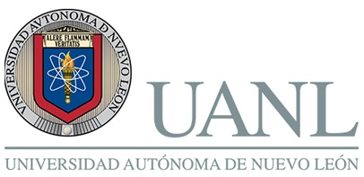
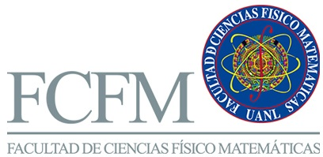

  
  &nbsp;&nbsp;&nbsp;&nbsp;&nbsp;&nbsp;&nbsp;&nbsp;&nbsp;&nbsp;&nbsp;&nbsp;&nbsp;&nbsp;&nbsp;&nbsp;&nbsp;&nbsp;&nbsp;&nbsp;&nbsp;&nbsp;&nbsp;&nbsp;&nbsp;&nbsp;&nbsp;&nbsp;&nbsp;&nbsp;&nbsp;&nbsp;&nbsp;&nbsp;&nbsp;&nbsp;&nbsp;&nbsp;&nbsp;&nbsp;&nbsp;&nbsp;&nbsp;&nbsp;&nbsp;&nbsp;&nbsp;&nbsp;&nbsp;&nbsp;&nbsp;&nbsp;&nbsp;&nbsp;&nbsp;&nbsp;&nbsp;&nbsp;&nbsp;&nbsp;&nbsp;&nbsp;&nbsp;&nbsp;&nbsp;&nbsp;&nbsp;&nbsp;&nbsp;&nbsp;&nbsp;&nbsp;&nbsp;&nbsp;&nbsp;&nbsp;&nbsp;&nbsp;&nbsp;&nbsp;&nbsp;&nbsp;&nbsp;&nbsp;&nbsp;&nbsp;&nbsp;&nbsp;&nbsp;&nbsp;&nbsp;&nbsp;&nbsp;&nbsp;&nbsp;&nbsp;&nbsp;&nbsp;&nbsp;&nbsp;&nbsp;&nbsp;&nbsp;&nbsp;&nbsp;&nbsp;&nbsp;&nbsp;&nbsp;&nbsp;&nbsp;&nbsp;&nbsp;&nbsp;&nbsp;&nbsp;
  

# Academias de Ciencias Computacionales, Seguridad en TI y Ciberseguridad — FCFM-UANL

**Repositorio oficial de divulgación académica en temas de Ciberseguridad de la Facultad de Ciencias Físico Matemáticas (FCFM), Universidad Autónoma de Nuevo León (UANL).**  
Este espacio reúne materiales educativos, infografías, ejercicios y soluciones aplicados en talleres, retos y eventos de Ciberseguridad y tecnologías afines organizados por:
- Academia de Ciencias Computacionales
- Academia de Seguridad en Tecnologías de Información
- Academia de Ciberseguridad

---

## 🎯 Propósito

Fortalecer la cultura de ciberseguridad en la comunidad universitaria y en el público general mediante recursos accesibles, éticos y técnicamente rigurosos.  
El contenido está diseñado para su uso en actividades académicas, sesiones de divulgación y autoformación.

---

## 📂 Contenido disponible

- **Ejercicios y respuestas**  
  Respuestas a los ejercicios de los talleres presenciales.  
  Carpeta: [`pdfs/respuestas/`](pdfs/respuestas/)

- **Ejercicios para atender en casa sobre criptografía y ciberseguridad**  
  Incluye explicaciones, instrucciones y soluciones.  
  Carpeta: [`pdfs/ejercicios/`](pdfs/ejercicios/)

- **Infografías de CIberseguridad**  
  Recomendaciones prácticas para estudiantes, docentes y familias.  
  Carpeta: [`infografias/`](infografias/)

---

## 📥 Descarga directa

Puedes descargar los materiales desde las carpetas del repositorio o desde la sección [Releases](https://github.com/MarViera/div_ciberseguridad_fcfmuanl/releases) para obtener paquetes completos por evento o versión.

---

## 🛡️ Licencia de uso

Este repositorio está bajo la licencia [Creative Commons Attribution 4.0 International (CC BY 4.0)](https://creativecommons.org/licenses/by/4.0/).  
El uso está permitido exclusivamente con fines educativos y no comerciales, siempre que se cite a la **Academia de Ciberseguridad de la FCFM-UANL** como fuente.

> Ejemplo de cita:  
> *Facultad de Ciencias Físico Matemáticas, Universidad Autónoma de Nuevo León. Material de divulgación, 2025.*

---

## 🖼️ Créditos institucionales

Este repositorio puede incluir logotipos oficiales de:
- Universidad Autónoma de Nuevo León (UANL)
- Facultad de Ciencias Físico Matemáticas (FCFM)

Los logotipos se utilizan con fines de identificación institucional y no deben ser modificados ni reutilizados fuera del contexto académico.  
Carpeta: [`assets/logos/`](assets/logos/)

---

## 🧩 Cómo contribuir o reportar errores

Si detectas erratas o deseas proponer mejoras:
- Abre un [Issue](https://github.com/MarViera/div_ciberseguridad_fcfmuanl/issues)
- O envía un correo institucional a: **lsti.fcfm@uanl.edu.mx**

---

## 📅 Actualizaciones

Este repositorio se actualiza conforme a los eventos de divulgación y actividades académicas de la Academia.  
Consulta la sección [Releases](https://github.com/MarViera/div_ciberseguridad_fcfmuanl/releases) para obtener versiones específicas.

---

## 🤝 Contacto institucional
> *“La ciberseguridad no comienza con la tecnología, sino con la conciencia. Educar es proteger.”*  
**Academias de Ciencias Computacionales, de Seguridad en Tecnologías de Información y de Ciberseguridad**  
Facultad de Ciencias Físico Matemáticas  
Universidad Autónoma de Nuevo León  
San Nicolás de los Garza, Nuevo León, México  
Correo: lsti.fcfm@uanl.edu.mx
